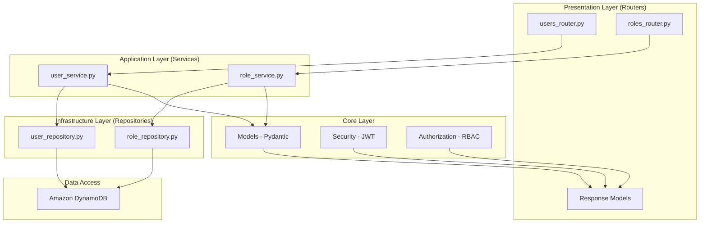
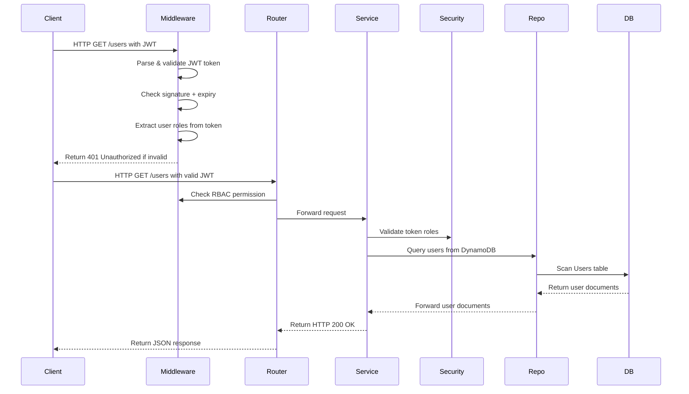

# user-service

> 📝 **Note**: This README was generated with the assistance of AI.

## About

This is a **resource server** 🛡️ for user and role management with hierarchical Role-Based Access Control (RBAC). It is designed to be deployed as an **AWS Lambda** function behind **API Gateway v2**, storing data in **DynamoDB**.

It is a **resource server** — it validates externally-issued JWT tokens but does **not** issue tokens itself. An external identity provider (e.g. Auth0, Cognito, custom OIDC) handles authentication and token issuance.

The service is a good fit for:
- **Internal tooling** 🛠️ — admin panels, dashboards, back-office user management
- **Multi-role systems** 👥 — apps where users have different permission tiers (e.g. viewer, editor, admin)
- **Serverless architectures** ⚡ — teams already on AWS Lambda/DynamoDB looking for a drop-in authz layer

## Overview

This repository contains a FastAPI application that provides CRUD operations for users and roles with authorization capabilities.

### Architectural Overview 🏗️

The application follows a **clean architecture** (also known as layered architecture) pattern, organizing code into distinct responsibility layers. Each layer has a single responsibility and interacts only with adjacent layers, making the codebase testable, maintainable, and decoupled.



#### Layer Descriptions

- **Presentation Layer (Routers)**: FastAPI routers that define HTTP endpoints, validate request data through Pydantic schemas, and extract the business requirements from business rules. Authentication/authorization guards routes using role-based access control.

- **Application Layer (Services)**: Business logic orchestrators that coordinate multiple repositories, validate data before persistence, and handle complex workflows. Services contain no Database access logic.

- **Infrastructure Layer (Repositories)**: Data access abstractions following Data Access Object pattern. They encapsulate DynamoDB-specific code, handling transactions, soft deletions, and error handling.

- **Core Layer**: Contains pure data models (Pydantic), security utilities (JWT validation, password hashing), and authorization decorators for role-based access control without I/O dependencies.

### Data Flow Architecture 🔀



1. **Single Responsibility**: Each component does one thing
2. **Open/Closed**: Extensions should be added by modifying existing interfaces
3. **Dependency Injection**: All layers receive dependencies rather than creating them
4. **Fail-Fast**: Invalid data is rejected immediately at the input boundary
5. **Soft Deletion**: Data is preserved for audit and recovery purposes
6. **Separation of AuthN/AuthZ**: Authentication (who you are) is validated by JWT Bearer; Authorization (what you can do) is enforced by role-based access control decorators

**Key Technologies:**
- Python 3.14
- FastAPI
- AWS Lambda (serverless deployment)
- DynamoDB
- Terraform (Infrastructure-as-Code)

## Project Structure 📁

```
app/                  # Application code
  - api/              # API endpoints
  - services/         # Business logic
  - repositories/     # Data access layer
  - middlewares/      # Request middleware
  - dependencies/     # Shared utilities
infrastructure/       # Terraform configuration
scripts/              # Build and deployment scripts
tests/                # Unit and integration tests
```

## Prerequisites ✅

- Python 3.14+
- AWS account with DynamoDB, Lambda, and IAM permissions
- Terraform installed

## Local Development 💻

```bash
uv sync                              # Install dependencies
uv run uvicorn app.api_handler:app --reload  # Start dev server on :8080
uv run pytest                        # Run tests
```

Environment is configured via `.env` (see `.env.example`). Secrets are fetched from AWS SSM Parameter Store at runtime.

## Deployment 🚀

Infrastructure is managed via Terraform (`infrastructure/`). Lambda artifacts are built and uploaded to S3, then Terraform provisions:

- DynamoDB tables (users + roles) with GSIs
- API Gateway v2 HTTP API
- Lambda function + IAM role + SSM parameters

Build scripts in `scripts/` handle packaging and upload:

```bash
./scripts/build_api.sh
./scripts/upload_api.sh
terraform apply
```

## API 📡

Base path: `/api/v1`

### Users

| Method | Path | Auth | Description |
|--------|------|------|-------------|
| POST | `/users` | `users:write` | Create user (email, username, password, display_name) |
| GET | `/users` | `users:read` | List users (paginated, filterable) |
| GET | `/users/{id}` | `users:read` | Get user by ID |
| PUT | `/users/{id}` | `users:write` | Update user fields |
| DELETE | `/users/{id}` | `users:write` | Soft-delete user |
| POST | `/users/{id}/validate` | `users:read` | Validate password, updates `last_login_at` |

- Emails are normalized to lowercase, uniqueness enforced on email and username
- Password hashed with Argon2 before storage; auto-rehashing on parameter changes
- Soft-delete via `deleted_at` timestamp (records retained in DynamoDB)

### Roles

| Method | Path | Auth | Description |
|--------|------|------|-------------|
| POST | `/roles` | `roles:write` | Create role with hierarchical path |
| GET | `/roles/{id}` | `roles:read` | Get role by ID |
| GET | `/roles/name/{name}` | `roles:read` | Get role with inherited permissions |
| PUT | `/roles/{id}` | `roles:write` | Update role |
| DELETE | `/roles/{id}` | `roles:write` | Delete role |

- Hierarchical path encoding: `PARENT#CHILD#GRANDCHILD` — last segment must match `id`
- Permission inheritance: child roles inherit all ancestor permissions
- Lineage resolution via `get_role_lineage()` builds paths progressively from root to leaf

## Schema 🗄️

### User
| Field | Type | Notes |
|-------|------|-------|
| `id` | UUID | Primary key (HASH) |
| `email` | String | GSI `EmailIndex` |
| `username` | String | GSI `UsernameIndex` |
| `password` | String | Argon2 hash |
| `roles` | List[String] | Role IDs assigned to user |
| `deleted_at` | ISO 8601 | Soft-delete marker |

### Role
| Field | Type | Notes |
|-------|------|-------|
| `id` | String | Primary key (HASH) |
| `path` | String | GSI `PathIndex` — hierarchy encoding |
| `permissions` | List[String] | Permission strings (e.g. `users:read`) |
| `deleted_at` | ISO 8601 | Soft-delete marker |

## Testing

```bash
uv run pytest                              # Run all tests
uv run pytest -n 8                         # Parallel execution (8 workers)
uv run pytest --cov --cov-report=term-missing  # With coverage report
uv run ruff check                          # Lint
```

Tests use `moto` for DynamoDB mocking (repository tests) and `httpx.TestClient` for integration tests against the full FastAPI stack.

## License

MIT License - see [LICENSE](LICENSE)

## Security

- Password hashing with Argon2
- Soft-deletion for data retention
- Role-based access control (RBAC)
- JWT token validation

## Contributing

Pull requests are welcome. For security issues, please contact the maintainers directly.

## Support

- Issue tracker on GitHub
- AWS Support (for infrastructure-related questions)

---

*Note: Please do not share credentials, production configurations, or security vulnerabilities in public forums.*